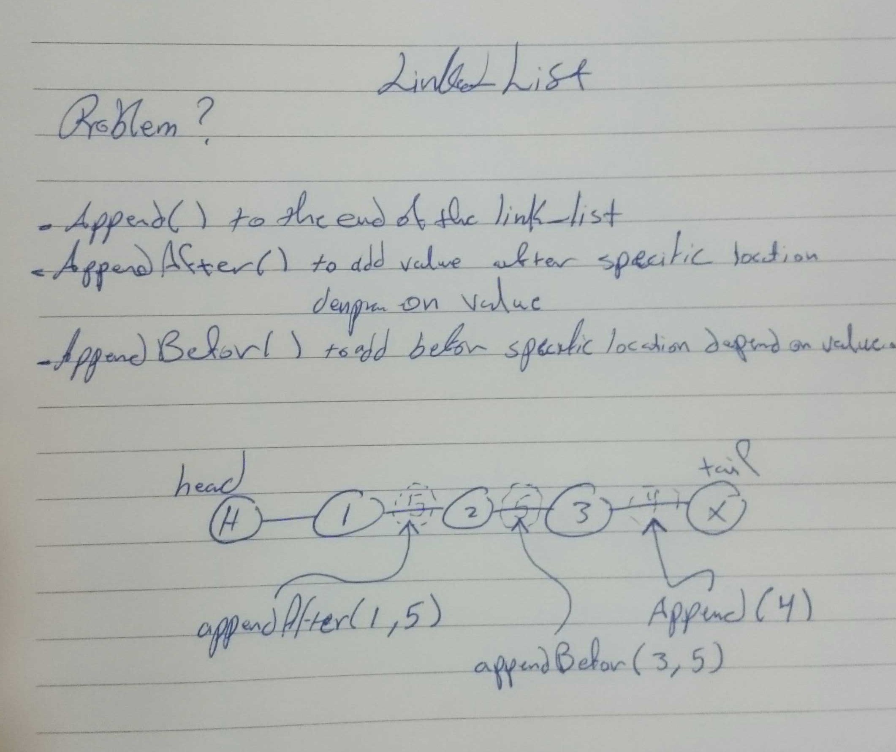

# data-structures-and-algorithms

## Code Challenge: Class 02 - arrayShift 
Insert and shift an array in middle at index

branch link :
https://github.com/401-advanced-javascript-Dante/data-structures-and-algorithms/tree/array-shift

white board image :

## Code Challenge: Class 03 - BinarySearch 
Binary search in a sorted 1D array

branch link :
https://github.com/401-advanced-javascript-Dante/data-structures-and-algorithms/tree/array-binary-search

white board image :

## Code Challenge: Class 04 - Fib & Summing
Fibo & Summing array of arrays

branch link :
https://github.com/401-advanced-javascript-Dante/data-structures-and-algorithms/tree/interviews

white board image :

## Code Challenge: Class 05 - Linked List
Linked list insertions.

branch link :
https://github.com/401-advanced-javascript-Dante/data-structures-and-algorithms/tree/linked-list

white board image :

## Code Challenge: Class 06 - Linked List
Linked list insertions.

branch link :
https://github.com/401-advanced-javascript-Dante/data-structures-and-algorithms/tree/ll-insertions

white board image :

## Code Challenge: Class 06 - Linked List
k-th value from the end of a linked list.

branch link :
https://github.com/401-advanced-javascript-Dante/data-structures-and-algorithms/tree/ll-kth-from-end
white board image :

