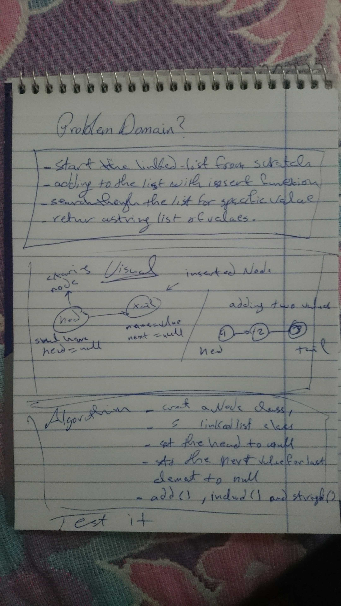
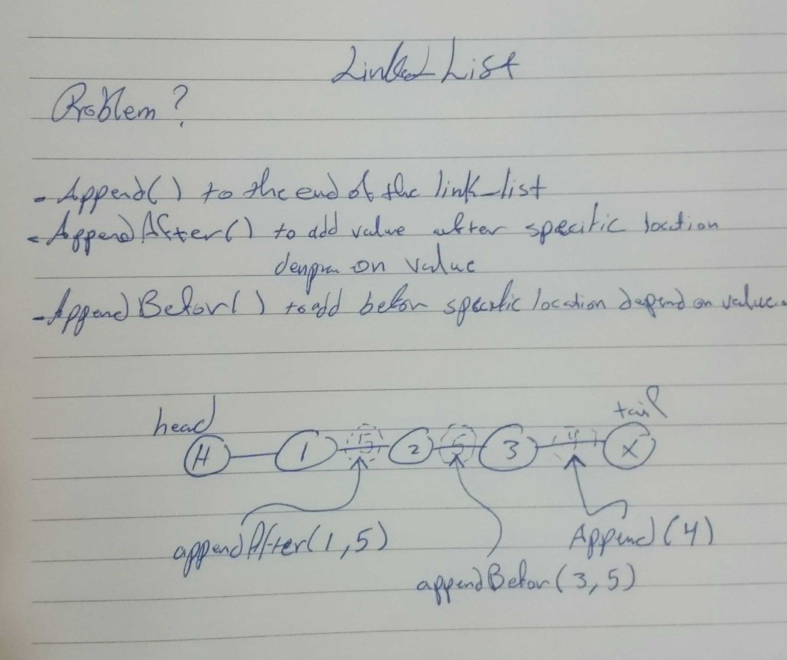

# Challenge Summary
<!-- Short summary or background information -->
create a node class 
create linked list class 
insert and search through the linked-list
adding append() , insertBefore() , insertAfter() functions .
adding kthFromEnd() ;

## Challenge Description
<!-- Description of the challenge -->
- i need to create a linked list by using two classes one for the node and other for linked list , i need to have a function to add nodes to the list and another one to search through it nodes for a value to check if it exist or not , 
- then adding append() , insertBefore() , insertAfter() functions  to add values to the end of the link or to specific location in the list .
- adding adding kthFromEnd() that take number of the index > 0 as an input and return the value of the node exist at input , knowing that we start countering from the tail of the linked-list 

## Approach & Efficiency
<!-- What approach did you take? Why? What is the Big O space/time for this approach? -->
- i create a class for the linked list have a constructor function and functions to add node and check the nodes for specific value and return true or false depend on that , also create a test for each feature of the challenge .

- adding new functions that help to add , update and find values of nodes .

## Solution
<!-- Embedded whiteboard image -->
### challenge 5 

Big O notation :
insert() => O(1) , we check once and inserting the value to the end .
include() => O(1) , same as insert we are going through once to check the value exist or not .
toString() => O(1) , we go once through it .

### challenge 6

Big O notation :
append() => here we can say O(1) because we go through the LL one .
insertBefore() => because we going once and we stopped when we found the value we want to insert before to here we can say it O(n) but notice that when we want to add after the new value we start from the beginning again so O(2n) . 
insertAfter() => we going once and we stopped when we found the value we want to insert after it so here we can say 
it O(1) .

### challenge 7

Big O notation :
here i made a counter so i can go through from the head to the tail even if you giving me the position from the end , then i go one through the linked list to get the value , if i don't used the counter here we can say O(1) , but long as i use it it will be O(2n) .

