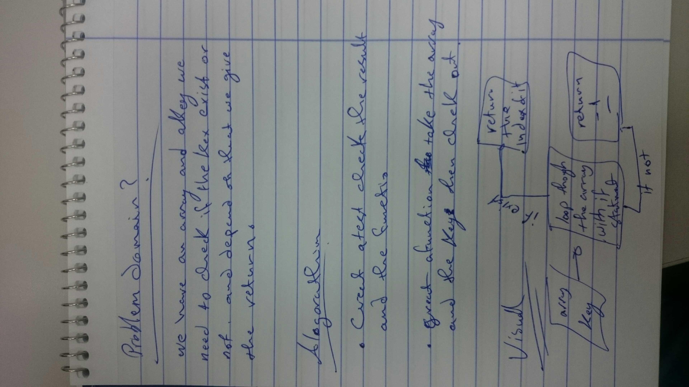

# Challenge Summary
<!-- Short summary or background information -->
function to sum arrays in array .
function to find fibo number at spacific index .
## Challenge Description
<!-- Description of the challenge -->
Write a function which takes in an array of arrays and given you array of summation of each array .

Write another one which take input an integer as index of fibo method , and the output should be the correct number at this index .

## Approach & Efficiency
<!-- What approach did you take? Why? What is the Big O space/time for this approach? -->
i approached a method that adding the value in the middle of the array without using any built-in methods , i give it the big o space because i find it challenging .

## Solution
<!-- Embedded whiteboard image -->

summing function :
following the whiteboard , using for loop and create a new array , adding values of the sum for each one to the new array.

fibo function :
following the whiteboard , using a while loop to made a fibo series until we reach the index that we insert it as an input then give the value of it .
