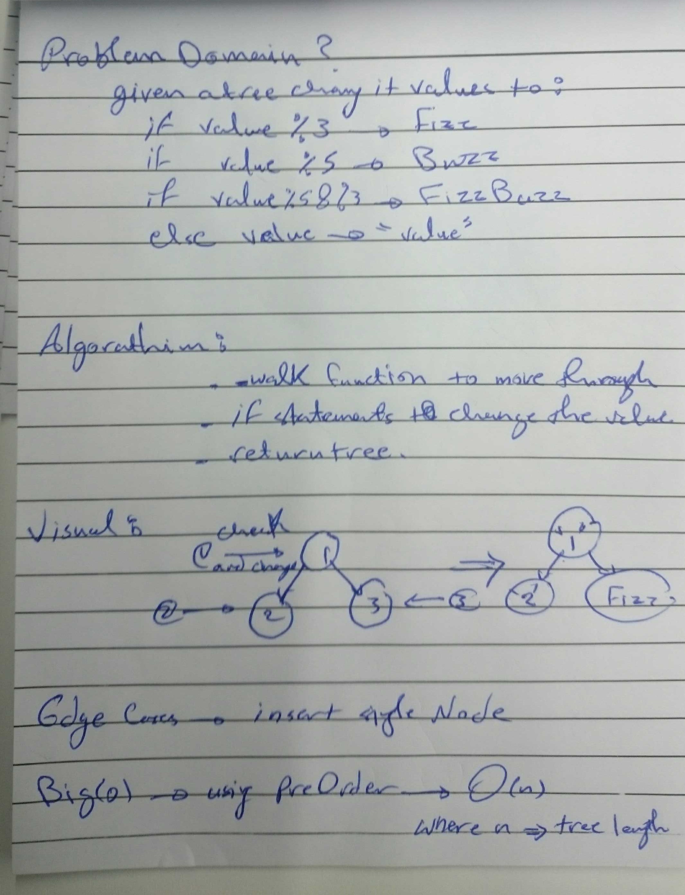

# Challenge Summary
<!-- Short summary or background information -->
- Conduct “FizzBuzz” on a tree while traversing through it.
Change the values of each of the nodes dependent on the current node’s value .

## Challenge Description
<!-- Description of the challenge -->
- Write a function called FizzBuzzTree() which takes a tree as an argument.
Without utilizing any of the built-in methods available to your language, determine whether or not the value of each node is divisible by 3, 5 or both .

## Approach & Efficiency
<!-- What approach did you take? Why? What is the Big O space/time for this approach? -->
- by using preOrder method to go throw tree elements with if statement change the value of the node if it %3 to Fizz ,
if %5 to Buzz if both to FuzzBuzz if none of them change the value type to string .

## Big O notation
- for fizz-buzz() we used preOrder method to go through all nodes it will be O(n) where n is the length of the tree .

## WhiteBoard 
<!-- Embedded whiteboard image -->

