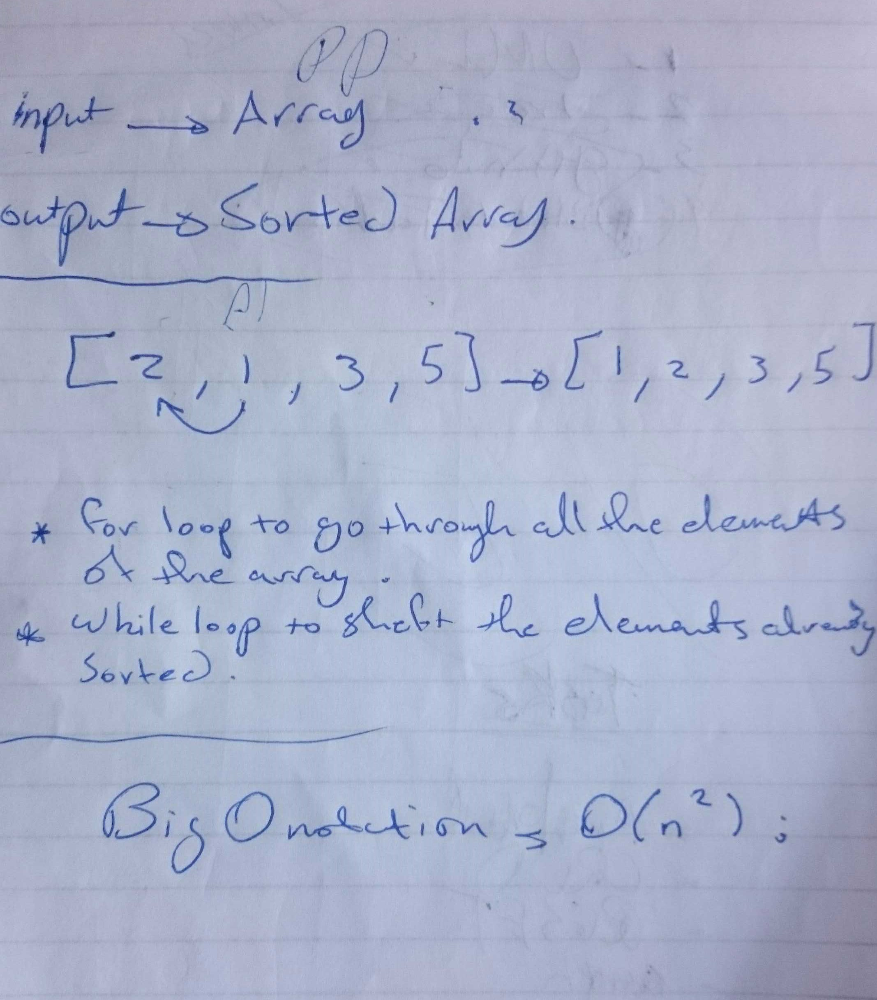

# Challenge Summary
<!-- Short summary or background information -->
- Insertion Sort
Insertion sort is a simple sorting algorithm that works the way we sort playing cards in our hands.

## Challenge Description
<!-- Description of the challenge -->
- Provide a visual step through for each of the sample arrays based on the provided pseudo code
- Convert the pseudo-code into working code in your language
- Present a complete set of working tests

## Approach & Efficiency
<!-- What approach did you take? Why? What is the Big O space/time for this approach? -->
- i build insertionSort() function that take an array as input and sort it using insertion method .  

## Big O notation
- Going through the array once with the first for loop then using while loop inside will increase the complexity to O(n^2).
## WhiteBoard 
<!-- Embedded whiteboard image -->

