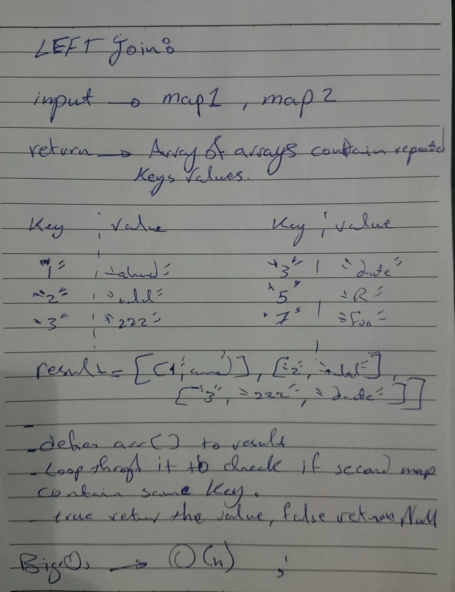

# Challenge Summary
<!-- Short summary or background information -->
- Implement a simplified LEFT JOIN for 2 Hashmaps.
- Write a function that LEFT JOINs two hashmaps into a single data structure.

## Challenge Description
<!-- Description of the challenge -->
- The first parameter is a hashmap that has word strings as keys, and a synonym of the key as values.
- The second parameter is a hashmap that has word strings as keys, and antonyms of the key as values.
- Combine the key and corresponding values (if they exist) into a new data structure according to LEFT JOIN logic.
- LEFT JOIN means all the values in the first hashmap are returned, and if values exist in the “right” hashmap, they are appended to the result row. If no values exist in the right hashmap, then some flavor of NULL should be appended to the result row.
- The returned data structure that holds the results is up to you. It doesn’t need to exactly match the output below, - so long as it achieves the LEFT JOIN logic.
- Avoid utilizing any of the library methods available to your language.

## Approach & Efficiency
<!-- What approach did you take? Why? What is the Big O space/time for this approach? -->
- i build leftJoin() function that take two maps and store first map keys in an array and then loop through it ,to check if the other map have the same keys or not , depend on that return the keys and values 

## Big O notation

- save the keys in an array and loop once to check the repeated keys to add there values give us O(n) where is n is the array length .
## WhiteBoard 
<!-- Embedded whiteboard image -->

