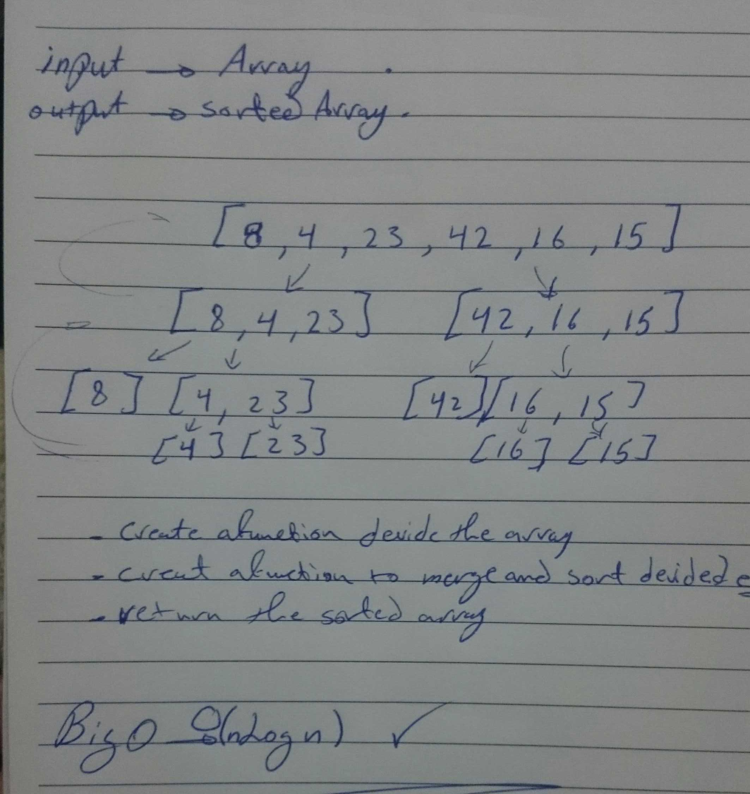

# Challenge Summary
<!-- Short summary or background information -->
- merge Sort
Merge Sort is a Divide and Conquer algorithm. It divides input array in two halves, calls itself for the two halves and then merges the two sorted halves .
## Challenge Description
<!-- Description of the challenge -->
- Provide a visual step through for each of the sample arrays based on the provided pseudo code
- Convert the pseudo-code into working code in your language
- Present a complete set of working tests

## Approach & Efficiency
<!-- What approach did you take? Why? What is the Big O space/time for this approach? -->
- i build mergeSort() function that take an array as input and sort it using merge method .  

## Big O notation
- Going with a Divide and Conquer algorithm the Big O gonna be O(nlogn) .

## WhiteBoard 
<!-- Embedded whiteboard image -->

