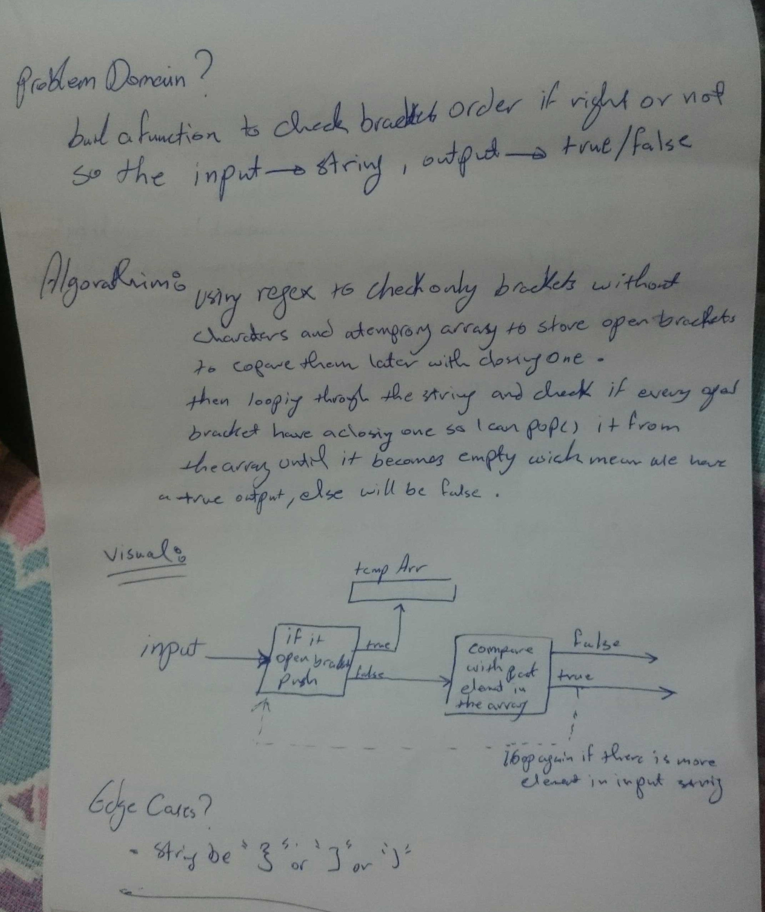

# Challenge Summary
<!-- Short summary or background information -->
create a function take a string as input and return a boolean , i should check i the brackets are ordered right or not and depend on that return a boolean .

## Challenge Description
<!-- Description of the challenge -->
my function should take a string as its only argument, and should return a boolean representing whether or not the brackets in the string are balanced. There are 3 types of brackets:
Round Brackets : ()
Square Brackets : []
Curly Brackets : {}

## Approach & Efficiency
<!-- What approach did you take? Why? What is the Big O space/time for this approach? -->
building a function with regular expression to ignore anything than brackets , starting with pushing open brackets to temporary array until we reach close one we pop last element in the array and check if it the right one for the close bracket , if not return false .

## Big O notation :
going through the string once , using a temporary array for checking the top element , i thing
the big O here going to be O(1) .

## Solution
<!-- Embedded whiteboard image -->

