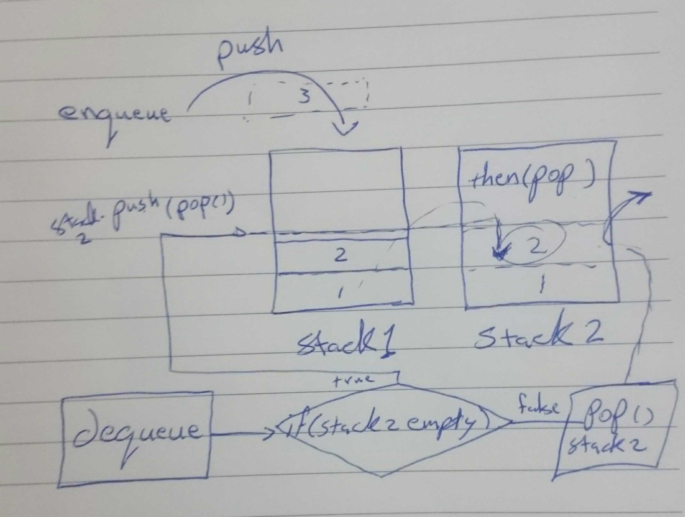

# Challenge Summary

Implement a Queue using two Stacks.
PseudoQueue class will implement our standard queue interface .

## Challenge Description
<!-- Description of the challenge -->
Create a brand new PseudoQueue class.
this PseudoQueue class will implement our standard queue interface, but will internally only utilize 2 Stack objects.
with the following methods:
- dequeue() 
- enqueue()

## Approach & Efficiency
<!-- What approach did you take? Why? What is the Big O space/time for this approach? -->
by using the previous challenge Stack class i create two stacks und used the push method to add to the first stack 
and used pop to remove from the other one , the trick is to push all the nodes in the first stack to the second one so when we pop , we take what was first in , so first in first out .. 

about the Big O when we enqueue we use the push method so same as last challenge O(1) , and for the dequeue the worst case scenario will be when we don't have nodes in the second stack so it push all nodes from the first one to it so O(2).

## Solution
<!-- Embedded whiteboard image -->

