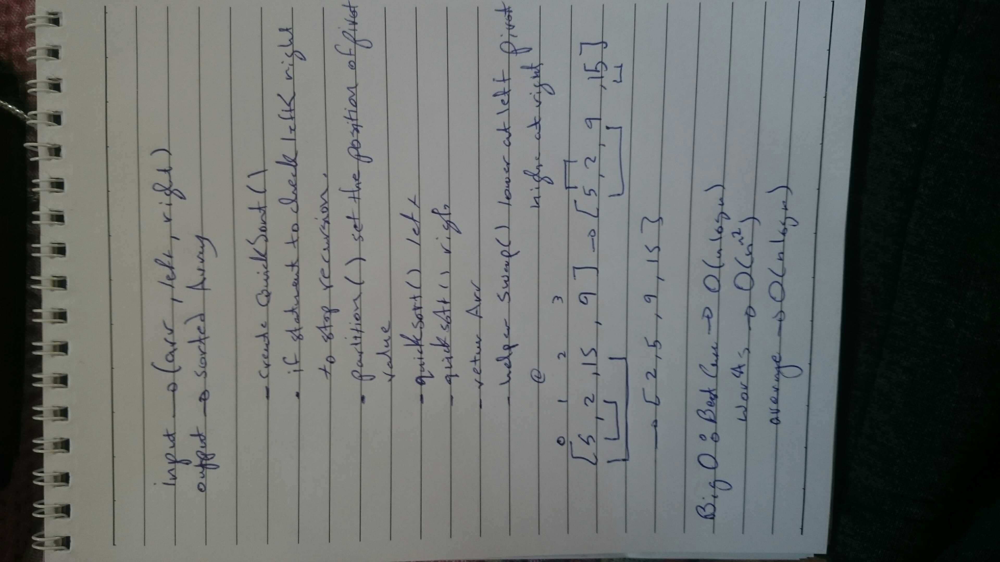

# Challenge Summary
<!-- Short summary or background information -->
- quick Sort
quick sort is a simple sorting algorithm that works the way we sort playing cards in our hands.

## Challenge Description
<!-- Description of the challenge -->
- Provide a visual step through for each of the sample arrays based on the provided pseudo code
- Convert the pseudo-code into working code in your language
- Present a complete set of working tests

## Approach & Efficiency
<!-- What approach did you take? Why? What is the Big O space/time for this approach? -->
- i build quickSort() function that take an array as input and sort it using quick method .  
- using 2 helper functions one for swap() and other to partition the array .

## Big O notation
- Worst Case: The worst case occurs when the partition process always picks greatest or smallest element as pivot so we get O(n^2) .
- Best Case: The best case occurs when the partition process always picks the middle element as pivot sw we get O(nlogn).
-Average Case: To do average case analysis, we need to consider all possible permutation of array and calculate time taken by every permutation which doesn’t look easy so we get O(nLogn) .

## WhiteBoard 
<!-- Embedded whiteboard image -->

