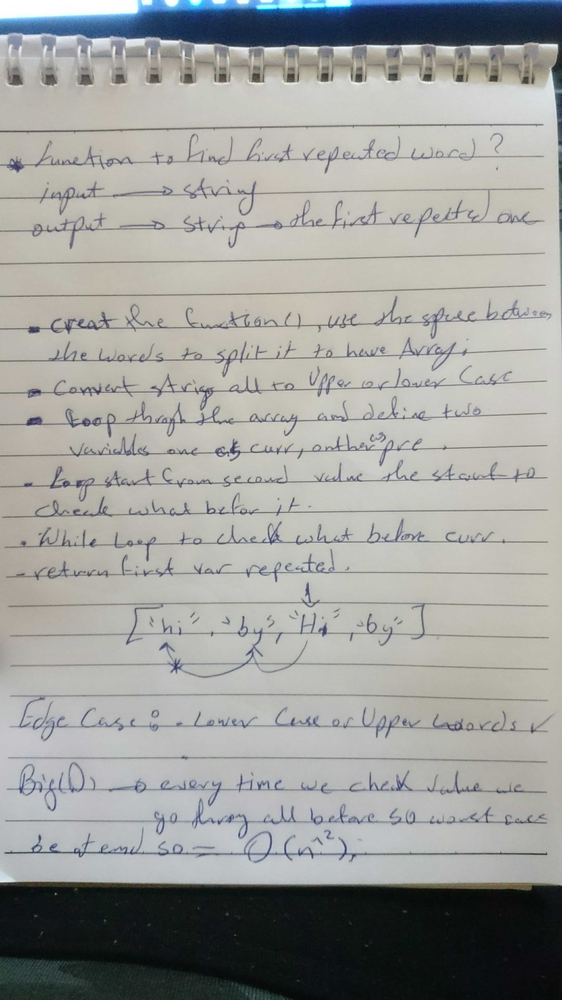

# Challenge Summary
<!-- Short summary or background information -->
Write a function that accepts a lengthy string parameter.
Without utilizing any of the built-in library methods available to your language, return the first word to occur more than once in that provided string.

## Challenge Description
<!-- Description of the challenge -->
i need to write a function take a string as an input and return the first word repeated in it.

## Approach & Efficiency
<!-- What approach did you take? Why? What is the Big O space/time for this approach? -->
split the string ==> for loop to take each element ==> compare it with elements before ==> return first word repeated .

## Big O
Worst case gonna be have the repeated word at the beginning and last of the string so we need to go once through the for loop and go through all elements before with while loop to check . 
O(n^2) . 

## Solution
<!-- Embedded whiteboard image -->

