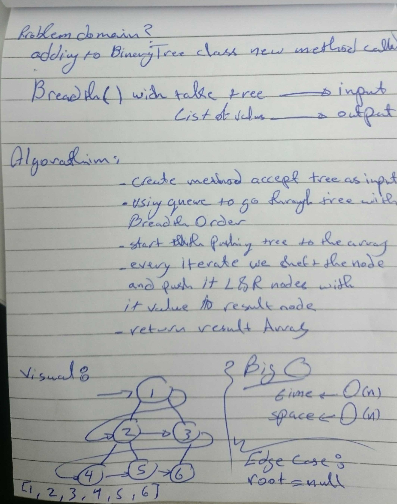

# Trees
<!-- Short summary or background information -->
A binary tree is made of nodes, where each node contains a "left" reference, a "right" reference, and a data element.
The topmost node in the tree is called the root. 
Every node (excluding a root) in a tree is connected by a directed edge from exactly one other node. 
This node is called a parent.

<!- code challenge 17 ->
a breadth first traversal method which takes a Binary Tree as its unique input.
 Without utilizing any of the built-in methods available, traverse the input tree using a Breadth-first approach, and return a list of the values in the tree in the order they were encountered.

 <!- code challenge 18 ->
instance method called find-maximum-value. 
Without utilizing any of the built-in methods available , return the maximum value stored in the tree.
assuming that the values stored in the Binary Tree will be numeric .

## Challenge
<!- Description of the challenge ->
Create a Node class that has properties of value , left and the right node .
Create a BinaryTree class with preOrder(),postOrder() and inOrder() methods .
Create a BinarySearchTree class with add() and contain() methods

<!- code challenge 17 ->
Extends a BinaryTree class with breadth() method .

<!- code challenge 18 ->
Extends a BinaryTree class with findMaxVal() method .

## Approach & Efficiency
<!-- What approach did you take? Why? What is the Big O space/time for this approach? -->

The Big O time complexity for inserting a new node is O(n).
Searching for a specific node will also be O(n). 
Because of the lack of organizational structure in a Binary Tree, the worst case for most operations will involve traversing the entire tree. 
If we assume that a tree has n nodes, then in the worst case we will have to look at n items, hence the O(n) complexity.

<!- code challenge 17 ->
Time complexity is O(|V|) where |V| is the number of nodes,you need to traverse all nodes.
Space complicity is O(|V|) as well - since at worst case you need to hold all vertices in the queue.

<!- code challenge 18 ->
 for findMaxVal() we used preOrder method to go through all nodes it will be O(n) where n is the length of the tree .

## API
<!-- Description of each method publicly available in each of your trees -->

For BinaryTree class we have 3 methods 
1- preOrder() where we push each node value at time we reach it .
2- postOrder() where we start pushing the node value when it have no left and right value .
3- inOrder() start pushing the node value if it have no left value .   

<!- code challenge 17 ->
extended the binaryTree with breadth() method .

<! code challenge 18 ->
findMaxVal() where it walk through all tree nodes to find the max value , i used preOrder method for that .

## Solution
<!- Embedded whiteboard image ->

<!- code challenge 17 ->

<!- code challenge 18 ->

