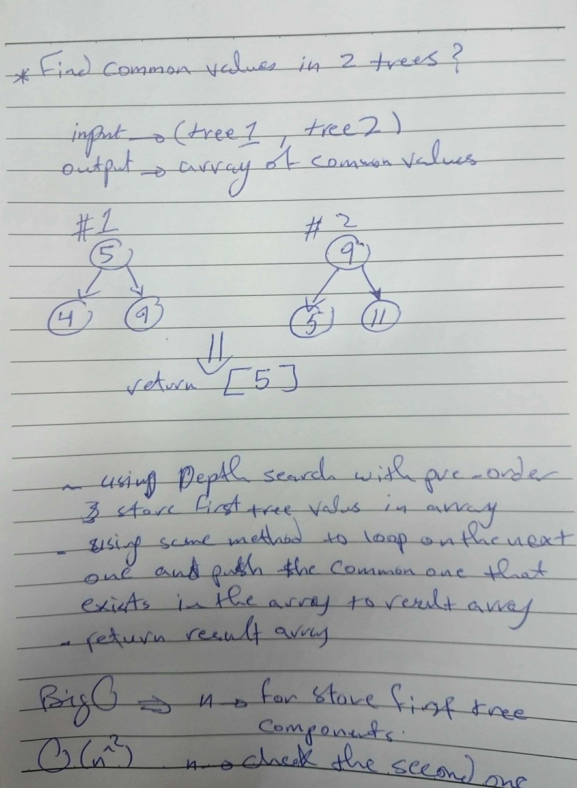

# Challenge Summary
<!-- Short summary or background information -->
- Find common values in 2 trees.

## Challenge Description
<!-- Description of the challenge -->
- Write a function called tree_intersection that takes two binary tree parameters.
- Without utilizing any of the built-in library methods available to your language, return a set of values found in both trees.

## Approach & Efficiency
<!-- What approach did you take? Why? What is the Big O space/time for this approach? -->
- i build tree_intersection() function that take two tree as inputs and return the repeated values between them , i reach thad by save the first tree values in an array then walk through the other array while i check if the current node exist in the first tree array .

## Big O notation
- Going through the first tree to store it data the going through the other one to check with recursion method ==> O(n^2).

## WhiteBoard 
<!-- Embedded whiteboard image -->

